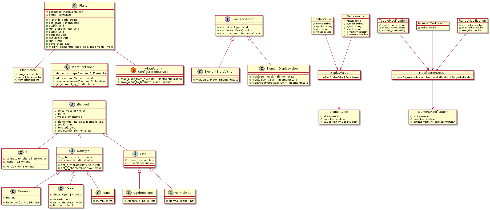

# LVTrans-

Modern LVTrans written in C++.

## Requirements

The plant should be able to:

| Done | Requirement                                                     | Designed in architecture? | Notes                                           |
| ---- | --------------------------------------------------------------- | ------------------------- | ----------------------------------------------- |
| [ ]  | Load existing plant from file                                   | OK                        |                                                 |
| [ ]  | Save plant to file                                              | OK                        |                                                 |
| [ ]  | Step simulation                                                 | OK                        |                                                 |
| [ ]  | Step simulation _N_ times                                       | OK                        |                                                 |
| [ ]  | Run simulation continuously                                     | OK                        | Maybe the client should be responsible instead? |
| [ ]  | Stop simulation                                                 | OK                        |                                                 |
| [ ]  | Pause simulation                                                | OK                        |                                                 |
| [ ]  | Resume simulation                                               | OK                        |                                                 |
| [ ]  | Save current simulation state                                   | OK                        |                                                 |
| [ ]  | Continue simulation from a loaded state                         | OK                        | Via constructor                                 |
| [ ]  | Read element outputs/state while the simulation is running      | OK                        | Via visitor pattern                             |
| [ ]  | Change supported runtime inputs while the simulation is running |                           |                                                 |
| [ ]  | Accept runtime input independently of the user interface        |                           |                                                 |
| [ ]  | Expose simulation output independently of the user interface    |                           |                                                 |
| [ ]  | Support execution faster than real time                         |                           |                                                 |
| [ ]  | Support multiple independent simulation instances               |                           |                                                 |

## Examples

_Load plant, step, step 100 times, and save plant along with the current state._

```cpp
int main(){
    Plant plant("example_plant.yaml");

    plant.step();

    plant.run_steps(100);

    plant.save("example_plant.yaml");
}
```

_Get a list of all the elements in the plant._
_Get an element by id and its state._

```cpp
int main(){
    Plant plant("example_plant.yaml");
    // std::variant ElementState<PipeState, ValveState, PumpState> state;

    std::vector<Element> elements = plant.get_elements();
    // expecting it to be pipe
    // get_element automatically dynamic_casts to the correct type
    Pipe& pipe1 = plant.get_element("pipe_1");

    // ElementStateVisitor? It knows how to talk to the element and get its state
    ElementVisitor state_visitor = new ElementStateVisitor();
    pipe1.accept(state_visitor); // Maybe print/draw to ui?


    Valve valve1 = plant.get_element("valve_1");
    ValveState valve1_state = valve1.get_state(); // ? 

    // ...
```

_Run simulation continuously until stopped._

```cpp
int main(){
    Plant plant("example_plant.yaml");

    plant.run_continuous(); // infinite loop until stopped?
}
```

_Change runtime element's parameters_

```cpp
int main(){
    Plant plant("example_plant.yaml");


    plant.set_element
}
```

## System Architecture (WIP)


